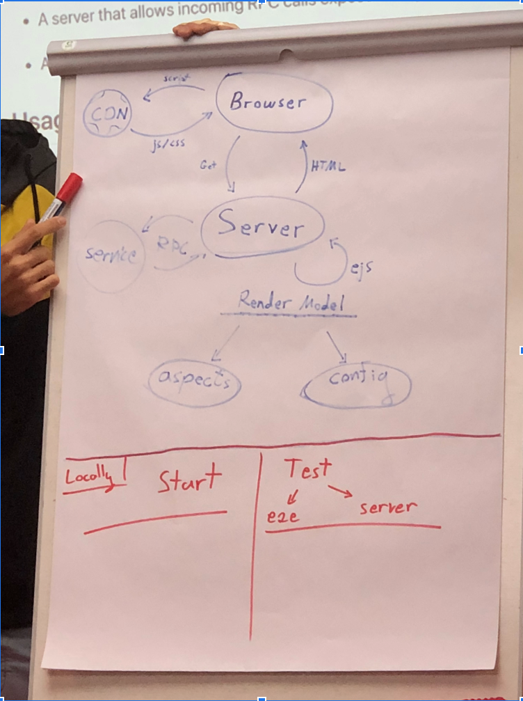

# Node Platfrom introduction

## Node Basics

## Express.js

[Example](https://gist.github.com/yanivefraim/4930348959f9eeb240c337c9a4e90563):

```js
const express = require('express');

const app = express();

const reqTime = (req, res, next) => {
    req.reqTime = Date.now();
    next();
}

app.use(reqTime);

app.get('/api/games', (req, res) => {
    res.send('hello world ' + req.reqTime);
});

app.get('*', (req, res) => {
    res.send('my page ' + req.reqTime);
});

app.listen(3000);
```

## Yoshi server architecture



Our moving parts are:

- Server
- Render Model
- CDN
- EJS template


### Server

We start by taking a look at the server which was generated by `create-yoshi-app`:

Server entry point is `index.js`:

```js
const bootstrap = require('@wix/wix-bootstrap-ng');

bootstrap()
  // https://github.com/wix-platform/wix-node-platform/tree/master/greynode/wix-bootstrap-greynode
  .use(require('@wix/wix-bootstrap-greynode'))
  // https://github.com/wix-platform/wix-node-platform/tree/master/bootstrap-plugins/hadron/wix-bootstrap-hadron
  .use(require('@wix/wix-bootstrap-hadron'))
  // https://github.com/wix-private/fed-infra/tree/master/wix-bootstrap-renderer
  .use(require('@wix/wix-bootstrap-renderer'))
  .express('./dist/server')
  .start();

```

`index.js` is pointing to our server file (`server.js`), which is the folowing function:

```js
module.exports = (app: Router, context) => {
    return app;
}
```

:bulb: We can remove all `server.js` code and run `node index.js` command, on each of the following steps. See how the server  is running, no magic! (also change `.express('./dist/server')` to `.express('./src/server')` so no need for `yoshi build` each time)

###### app

`app` is an [express router](https://expressjs.com/en/4x/api.html#router):

```js
  app.get('/', (req, res) => {
    res.send('hello there');
  });

```

We render our [`ejs`](https://github.com/mde/ejs) template using the `res.renderView` method, added by `app.use(context.renderer.middleware());`, but we can start with a simple 'vanilla' ejs rendering:

```js
const ejs = require('ejs');

app.get('/', async (req, res) => {
    //{title: 'hello'} is the model for our ejs template (change index.ejs to contain only `<%= title %>` to see it in action)
    const html = await ejs.renderFile('./src/index.ejs', {title: 'hello'});
    res.send(html);
});
```

###### context

`context` is the second argument injected to your server function. It contains several default objects, and can be enriched by using different `node-platform` plugins. See [context](https://github.com/wix-platform/wix-node-platform/tree/master/bootstrap/wix-bootstrap-ng#context) and [use](https://github.com/wix-platform/wix-node-platform/tree/master/bootstrap/wix-bootstrap-ng#wixbootstrapnguseobject-opts-this) for more details.

### Render Model

Our default generated server consumes data from two points:

###### Build / deploy time configuration - erb

We can consume build / deploy time configurations, using a Ruby [`erb`](https://ruby-doc.org/stdlib-2.6.5/libdoc/erb/rdoc/ERB.html) template. This `erb` template is evaluated by `cheff` during deployment (and every 15 minutes). See [CONFIGURATION_TEMPLATES](https://github.com/wix-private/fed-handbook/blob/master/CONFIGURATION_TEMPLATES.md) for more details.

Reading this erb json is done via `context`'s [config](https://github.com/wix-platform/wix-node-platform/tree/master/config/wix-config) function:

```js
    const config = context.config.load('{my artifact name}');
    console.log(config); // the Json generated form our erb template
```

###### Runtime request data - aspects

Each request to the server contains data about the specific request (such as locale, authentication etc.). We will have those on `req.aspects['web-context']`. See [wix-web-context-aspect](https://github.com/wix-platform/wix-node-platform/tree/master/aspects/wix-web-context-aspect) for more details.


### CDN

Our static files are served from `dist/statics` folder, by a different server (the CDN). Locally we serve it from `http://localhost:3200` (which simulates the CDN). 

Try running `node index.js` on one terminal and `npx serve dist/statics -l 3200` on the other and navigate to `http://localhost:3000` (you will have to run `npx yoshi build` first). 
